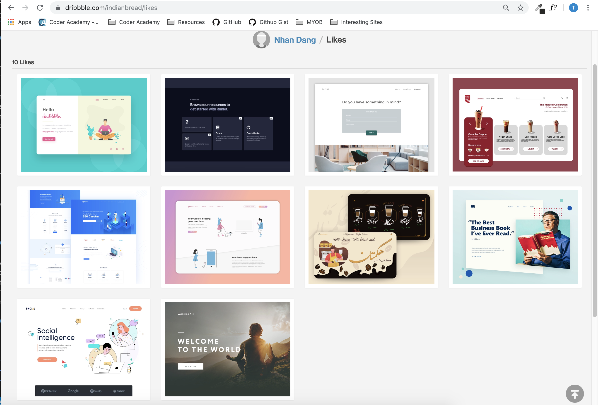
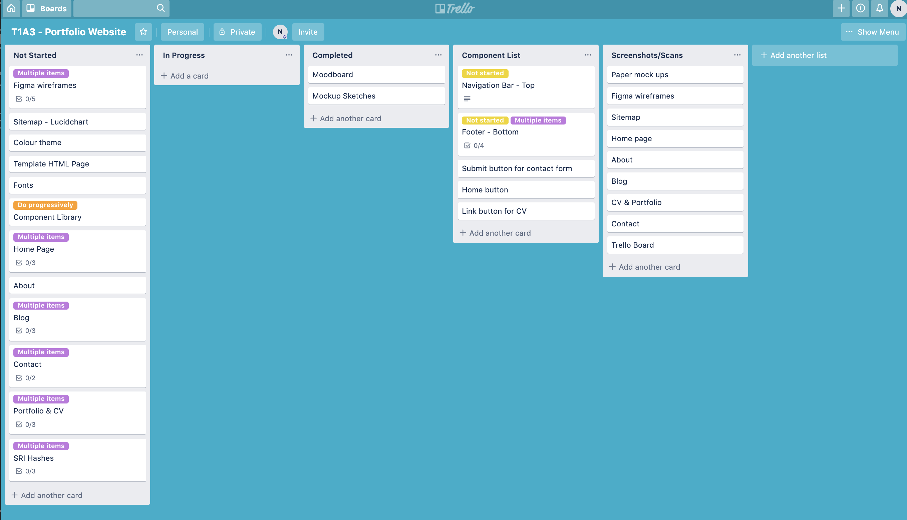

# T1A3 - PORTFOLIO WEBSITE #

## Link to website ##

## Link to Github Repository ##

## Powerpoint Slidedeck ##

## Website Details ##

### Purpose ###

This is my professional website which provides some information about me and my work.
The main purpose is to share my portfolio which includes work that I completed while in Coder Academy and afterwards.

### Functionality / features ###

### Sitemap ###

### Screenshots ###
Moodboard 
   

Trello  

### Target audience ###

This website is targeted towards industry peers, reruiters and potential employers. They can use this website to find out more about me and gain a better understanding of my skills and coding ability.

### Tech stack (e.g. html, css, deployment platform, etc) ###

### Design Process ###

1. Collate different website designs into a moodboard for inspiration using Dribbble. 
2. Mock up sketches of each page using pen and paper based on moodboard inspired designs. Took note of design name so I can go back and      refer to them later when building detailed components.
3. Create list & checklist in Trello
4. Look on coolers for colour theme
5. Write down site map
6. Construct wireframes in Figma based off sketches
7. Construct site map using Lucidchart
8. Make a template page in HTML to get a feel for colour theme
9. Make component library - create buttons
8. 

### Component List ###

Navigation Bar - Top
Footer - Bottom
Submit Button for contact form
Home button 
Link button for CV

### Pages ###

1. Home
2. About
  - Skils
  - Interests
  - Personality
3. Blog 
  - list of blog posts with link
  - 5 sample blog posts
    - placeholder text
    - all must have 1 image
4. Portfolio & CV
5. Contact - use formspree

