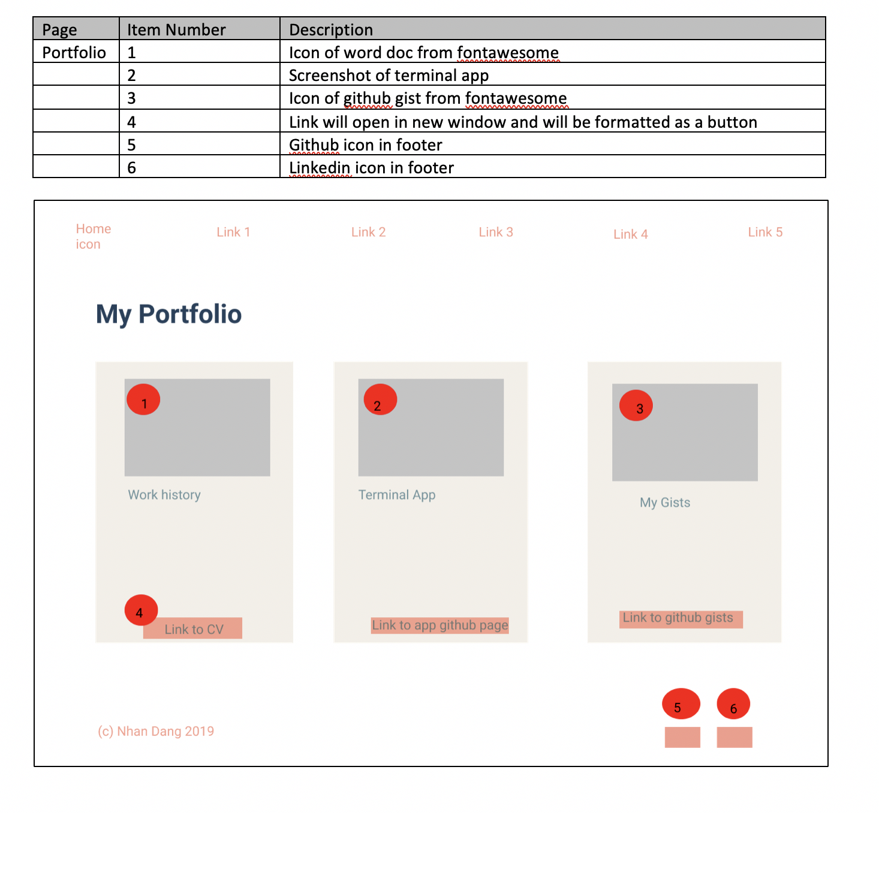
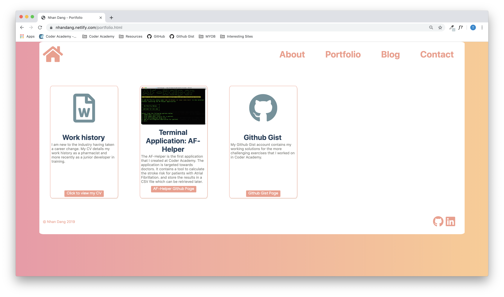

# T1A3 - PORTFOLIO WEBSITE #

## Link to website ##

### Master branch with standard menu: ###

https://nhandang.netlify.com/   

### Version 2 with Hamburger menu: ###

https://nhandang2.netlify.com/index.html

## Link to Github Repository ##  

https://github.com/indianbread/T1A3

## Purpose ##

This is my professional website which provides some information about me and my work.
The main purpose is to share my portfolio which includes work that I completed while in Coder Academy and afterwards.

## Functionality / features ##

* Navigation menu at the top of the page with a home button and links to the pages. The navigation menu will remain the same on all pages.

* Footer with a copyright and icons that link to my Github respistory and LinkedIn profile. The footer will remain at the bottom of every page.

* The blog will have a sidebar on the right hand side with the links to all the blog posts.

* The portfolio will use cards and include a screenshot or icon of the item, a title with the portfolio item and a description underneath. At the bottom of the card will be a button with a link to the item. The link will open in a new page.

* The contact form will look like a postcard (see third design in moodboard below).

## Sitemap ##

  

## Screenshots ##

### Moodboard ### 

   

### Trello - Day 1 ###

### Wireframes and Mock Ups ###

  
  
  
  

### Home Page ###

### About ###

### Portfolio ###

### Blog ###

### Contact ###

## Target audience ##

This website is targeted towards industry peers, reruiters and potential employers. They can use this website to find out more about me and gain a better understanding of my skills and coding ability.

## Tech stack (e.g. html, css, deployment platform, etc) ##

This website is coded using only HTML and CSS. The website documents are version controlled using a Git repository and published to Github. 
The website was deployed using Netlify by linking Netlify to the Github repository.

## Design Process ##

1. Collate different website designs into a moodboard for inspiration using Dribbble. 
2. Mock up sketches of each page using pen and paper based on moodboard inspired designs. Took note of design name so I can go        back and refer to them later when building detailed components.
3. Create list & checklist in Trello
4. Look on coolers for colour theme
5. Write down site map
6. Construct wireframes in Figma based off sketches
7. Construct site map using Lucidchart
8. Make a template page to get a feel for the design and code the 'base' body layout and containers
9. Copy and paste the template for each page and code each page using html and css simultaneously.

## Component List ##

* Navigation Bar - Top
* Footer - Bottom
* Submit Button for contact form
* Home button 
* Link button for portfolio items
* Cards for portfolio items
* Contact form
* Cards for blog posts
* Sidebar for links to blog posts
* Hamburger menu for second branch - mobile phone optimized version of the site

## Powerpoint Slidedeck ##

[Slidedeck](./ppt/NhanDang_T1A3.pptx)

